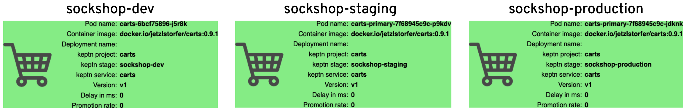

# Deploying the carts service

To deploy the service into your Kubernetes cluster, you can use the Keptn CLI to trigger a new deployment. 

## Deploying the database

First, we will deploy the database into our Kubernetes cluster by executing the following command:

```console
keptn send event new-artifact --project=sockshop --service=carts-db --image=mongo
```

## Deploying the service

Next, we deploy the carts microservice into the cluster by executing the following command:


```console
keptn send event new-artifact --project=sockshop --service=carts --image=docker.io/jetzlstorfer/carts --tag=0.9.1
```

To illustrate the scenario this use case addresses, Keptn relies on following internal services: shipyard-service, helm-service, jmeter-service, and gatekeeper-service. These services have the following responsibilities:

  - **shipyard-service:** 
    - Creates a project entity and stage entities as declared in the shipyard.
  - **helm-service:** 
    - Creates a new service entity, manipulates the Helm chart, and uploades the Helm chart to the configuration store.
    - Updates the service configuration when a new artifact is available.
    - Deploys a service when the configuration of a service has changed.
  - **jmeter-service:**
    - Runs a test when a new deployment of the service is available.
  - **gatekeeper-service:**
    - Evaluates the test result to decide whether the deployment can be promoted to the next stage or not.

To gain an overview of all services involved in the deployment/release of the service, you can use the **keptn's bridge**, which you have set up earlier.

# View the carts service

To make the carts service accesible from outside the cluster and to support blue/green deployments, Keptn automaticalliy creates **Istio** VirtualServices that direct requests to certain URLs to the correct service instance. You can retrieve the URLs for the carts service for each stage as follows:

```console
echo http://carts.sockshop-dev.$(kubectl get cm keptn-domain -n keptn -o=jsonpath='{.data.app_domain}')
```

```console
echo http://carts.sockshop-staging.$(kubectl get cm keptn-domain -n keptn -o=jsonpath='{.data.app_domain}')
```

```console
echo http://carts.sockshop-production.$(kubectl get cm keptn-domain -n keptn -o=jsonpath='{.data.app_domain}')
```

Navigate to the URLs to inspect your carts service. You should be able to see that Keptn deployed your carts service to all of your environments after executing all specified tests.



Let us now continue to activate the quality gates to control if a new version will be promoted or not.

---

[Previous Step: Onboarding carts service](../01_Onboarding_carts_service) :arrow_backward: :arrow_forward: [Next Step: Introducing quality gates](../03_Introducing_quality_gates)
