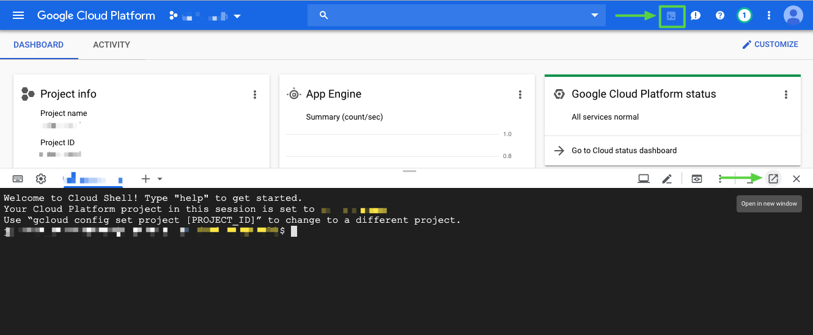
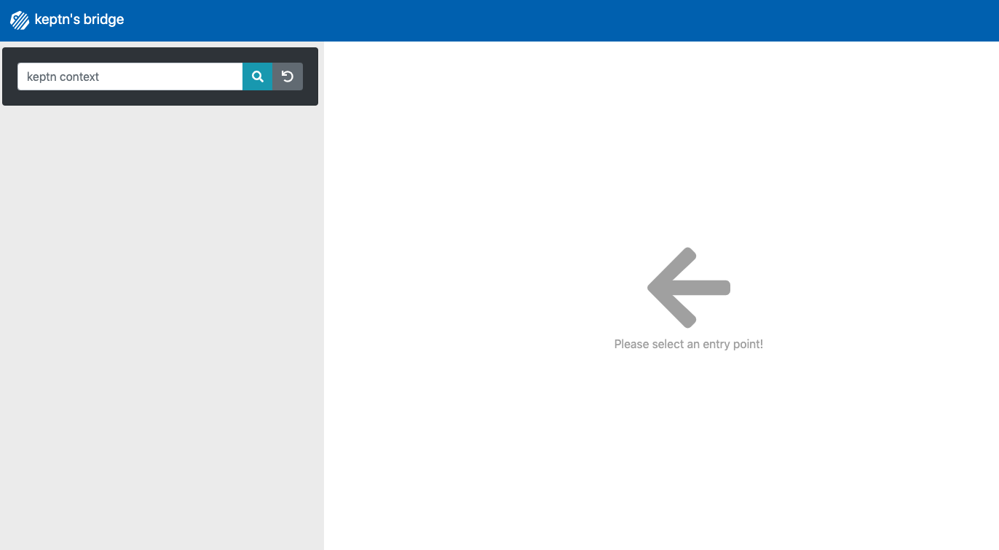

# Keptn Workshop Instructions

# Overview
In this workshop, you will get hands-on experience with the open source framework [Keptn](https://keptn.sh) and see how it can help you to manage your cloud-native applications on Kubernetes.
There is no need to install any software on your local machine, instead we will use cloud resources for the course of this workshop.

# Pre-requisites

## 1. Accounts 🎫

* **Dynatrace** - We will use Dynatrace to monitor our cluster as well as all our sample application. Therefore, create an account for a [free trial Dynatrace SaaS tenant](https://www.dynatrace.com/trial). See details in the [Keptn docs](https://keptn.sh/docs/0.5.0/reference/monitoring/dynatrace/).
* **(recommended:) GCP account** - A GCP account is suggested to utilize the Google Cloud Shell. It is recommended to sign up for personal free trial to have full admin rights and to not cause any issues with your enterprise account. Google Cloud Shell is free to use with an GCP account, [more information here](https://cloud.google.com/free/docs/gcp-free-tier). Use this link to sign up for a free trial: https://cloud.google.com/free/


## 2. Tools 🛠️

In this workshop, we are providing two options that will have all the required tools installed. 

* **Option A: Docker in Google Cloud Shell** - Run the Docker image with all required tools installed in the Google Cloud Shell to not have to install anything locally on your machine. 

    1. Go to [Google Cloud](https://console.cloud.google.com/home/dashboard?cloudshell=true) and activate Cloud Shell as shown below if it does not open automatically. Also, open the cloud shell in its own Window to make the workshop experience more comfortable.


        


* **Option B: Run Docker from your machine host** - If you have Docker installed on your local machine, you can simply start and connect to the Docker container locally. Open a Shell/Bash/Terminal to be ready to proceed.

Make sure you have decided for one option before proceeding.


1. To start the docker container you will use for this workshop, please execute:

    ```console
    docker run -it keptnworkshops/workshop-utils-gke:0.5.0 /bin/bash
    ```

    <details><summary>Instructions for other platforms</summary>
    Depending on the cloud platform you want to run your Kubernetes cluster, choose the correct Docker image.
    
    - GKE
        ```console
        docker run -it keptnworkshops/workshop-utils-gke:0.5.0 /bin/bash
        ``` 

    - AKS
        ```console
        docker run -it keptnworkshops/workshop-utils-aks:0.5.0 /bin/bash
        ``` 

    - EKS
        ```console
        docker run -it keptnworkshops/workshop-utils-eks:0.5.0 /bin/bash
        ``` 
    </details>

    This will download the Docker image (either to your local machine or your Cloud Shell) and will put you inside the Docker container once downloaded. All files needed for the workshop are already prepared for you inside this docker container.

1. Setup the Kubernetes cluster or connection to the cluster.

    - Setting up the actual cluster is out of scope of this workshop. Please find instructions for creating the cluster on the Keptn website itself https://keptn.sh/docs/0.5.0/installation/setup-keptn/#setup-kubernetes-cluster 


    - Make sure that the `kubectl` tool is pointed to the right cluster.
        ```console
        kubectl config current-context
        ```
        That should give you the name of the cluster you want to install Keptn on. If not, please follow the instructions of your Cloud provider platform to connect to the cluster.

        <details><summary>Example for GKE</summary>
        For GKE, you could execute this command:
        
        ```console
        gcloud container clusters get-credentials CLUSTERNAME --zone ZONE --project PROJECTNAME
        ```
        </details>


# Install Keptn ⚙️

## 1) Install Keptn

Install the Keptn control plane components into your cluster, using the **Keptn CLI**:

```console
keptn install --platform=gke
```
Please note that the Keptn install command does offer other platforms as well. A list of all supported platforms can be retrieved by executing `keptn install --help` .

The install will take about **5 minutes** to perform.

<details><summary>Details about this step</summary>

The Keptn CLI will now install all Keptn core components into your cluster, as well authenticating the Keptn CLI at the end of the installation. 

Once the installation is finished you should find a couple of pods running in your keptn namespace.

```console
$ kubectl get pods -n keptn

NAME                                                              READY   STATUS    RESTARTS   AGE
api-f7689c9d8-dj7vj                                               1/1     Running   0          2m3s
bridge-fd68b4c67-rf5dw                                            1/1     Running   0          2m3s
configuration-service-6d69f8c547-lm46q                            1/1     Running   0          2m2s
eventbroker-go-b65b9bb68-cm8c4                                    1/1     Running   0          2m3s
gatekeeper-service-665447b98b-dtmtb                               1/1     Running   0          2m3s
gatekeeper-service-evaluation-done-distributor-55cbcb5844-zpkn4   1/1     Running   0          2m1s
helm-service-5f65468cf6-2rbgt                                     1/1     Running   0          2m3s
helm-service-configuration-change-distributor-cfd57c9d9-hrq9c     1/1     Running   0          2m2s
helm-service-service-create-distributor-7bbdd68969-jwtjt          1/1     Running   0          2m2s
jmeter-service-84479f4bfd-qmfqz                                   1/1     Running   0          2m3s
jmeter-service-deployment-distributor-864bf9f745-9v2hb            1/1     Running   0          2m2s
keptn-nats-cluster-1                                              1/1     Running   0          2m31s
nats-operator-7dcd546854-mftl9                                    1/1     Running   0          2m49s
pitometer-service-6fd6c4bd9b-8vccf                                1/1     Running   0          2m3s
pitometer-service-tests-finished-distributor-5697bbd859-r48g7     1/1     Running   0          2m2s
prometheus-service-8676b7588f-j8pzj                               1/1     Running   0          53s
prometheus-service-monitoring-configure-distributor-7788487749d   1/1     Running   0          38s
remediation-service-5b486d69c-ljmfq                               1/1     Running   0          2m2s
remediation-service-problem-distributor-6d88b7d65c-8jwsm          1/1     Running   0          2m1s
servicenow-service-7cd9b8784-mrx7d                                1/1     Running   0          54s
servicenow-service-problem-distributor-7fccc4986-w9qg8            1/1     Running   0          38s
shipyard-service-7f88695b49-ncqr8                                 1/1     Running   0          2m3s
shipyard-service-create-project-distributor-7bff8fc48f-44v9l      1/1     Running   0          2m1s
shipyard-service-delete-project-distributor-786645fb7b-nw7p8      1/1     Running   0          2m1s
wait-service-55d476cd97-pfbht                                     1/1     Running   0          2m3s
wait-service-deployment-distributor-fdcf99f67-g7jl9               1/1     Running   0          2m1s
```

</details>

## 2) Collect tokens for Dynatrace

1. Make sure you have followed the prerequisites and have a Dynatrace tenant ready. If not, please sign up for a [free Dynatrace trial](https://www.dynatrace.com/trial). There is no need to install anything on your local machine. For now, just make sure you have created your tenant.

1. To be able to connect a Dynatrace tenant to the cluster, we will need an API as well as an Platform as a Service (PaaS) token from the Dynatrace tenant.
We recommend creating a temporary file and copying the following lines into an editor, fill them out and keep them as a reference for later:

    ```
    Dynatrace Host Name (e.g. abc12345.live.dynatrace.com):
    Dynatrace API Token:
    Dynatrace PaaS Token:
    ```

1. Login to your Dynatrace tenant and retrieve the tenant ID from the address bar of your browser. Please do copy only the characters between `https://` and the first `/` after the .dynatrace.com. E.g., a valid tenant ID would be abc1234.live.dynatrace.com 

    Copy it to your temporary file to keep it for later.

1. To retrieve the API and PaaS Token, login to your Dynatrace tenant and navigate in the left-hand menu to **Settings -> Integration -> Dyantrace API** and click on **Generate token**. Provide a name, e.g., **keptn-token** and make sure to create a token with the following permissions:
    <details><summary>Open for permissions</summary>
    
    - Access problem and event feed, metrics and topology
    - Access logs
    - Configure maintenance windows
    - Read configuration
    - Write configuration
    - Capture request data
    - Real user monitoring JavaScript tag management
    </details>

    Copy the value of the token into your temporary file.

1. Retrieve the PaaS Token by navigating to **Settings -> Integration ->Platform as a Service** and generate a new token again with a name of your choice, e.g., **keptn-token**. Copy the value to your temporary file to keep it as a reference.


## 3) Install Dynatrace

This will install the Dynatrace OneAgent Operator into your cluster.

1. Navigate to the `dynatrace-service` folder: 
    ```console
    cd /usr/keptn/scripts/dynatrace-service/deploy/scripts
    ```
1. Define your credentials.
    ```console
    ./defineDynatraceCredentials.sh
    ```
1. Install Dynatrace OneAgent Operator on your Cluster.
    ```console
    ./deployDynatraceOnGKE.sh
    ```
    Please note that the Dynatrace OneAgent Operator can be installed on other platforms as well and the scripts can be found in the same folder.

The install will take about **2 minutes** to perform.

## 4) Expose Keptn's Bridge - OPTIONAL

The [Keptn’s bridge](https://keptn.sh/docs/0.5.0/reference/keptnsbridge/) provides an easy way to browse all events that are sent within Keptn and to filter on a specific Keptn context. When you access the Keptn’s bridge, all Keptn entry points will be listed in the left column. Please note that this list only represents the start of a deployment of a new artifact. Thus, more information on the executed steps can be revealed when you click on one event.

In the default installation of Keptn, the bridge is only accessible via `kubectl port-forward`. To make things easier for workshop participants, we will expose it by creating a public URL for this component.

1. Navigate to the folder to expose the bridge.
    ```console
    cd /usr/keptn/scripts/expose-bridge
    ```

1. Execute the following script.
    ```console
    ./exposeBridge.sh
    ```

1. It will give you the URL of your Bridge at the end of the script. Open a browser and verify the bridge is running.

    


# Hands-on Labs 👩‍💻👨‍💻

After installing Keptn, we are now ready to explore to execute the following hands-on labs. They are based on each other, why it is important to complete them according to this order:

1. Onboarding the carts service: [Lab](./01_Onboarding_carts_service)
1. Deploying the carts service: [Lab](./02_Deploying_the_carts_service)
1. Introducing quality gates: [Lab](./03_Introducing_quality_gates)
1. Self-healing with Keptn: [Lab](./04_Self_Healing)

# Keptn Community 📢

Join the Keptn community!

Further information about Keptn you can find on the [keptn.sh](keptn.sh) website. Keptn itself lives on [GitHub](https://github.com/keptn/keptn).

**Feel free to contribute or reach out to the Keptn team using a channel provided [here](https://github.com/keptn/community)**.

Join our Slack channel!

The easiest way to get in contact with Keptn users and creaters is to [join our Slack channel](https://join.slack.com/t/keptn/shared_invite/enQtNTUxMTQ1MzgzMzUxLTcxMzE0OWU1YzU5YjY3NjFhYTJlZTNjOTZjY2EwYzQyYWRkZThhY2I3ZDMzN2MzOThkZjIzOTdhOGViMDNiMzI) - we are happy to meet you there!
